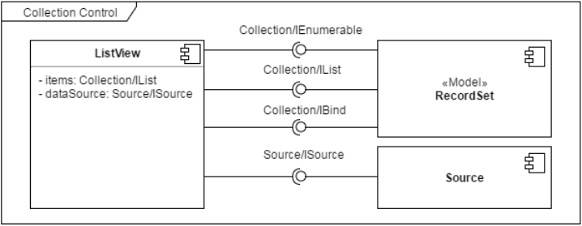

##### MVC
В срезе визуальных контролов принимается, что:
- моделью является или [абстрактная модель](https://wasaby.dev/doc/platform/models-collections-types/entity/#wsdataentitymodel)  (для простых контролов), или [коллекция](https://wasaby.dev/doc/platform/models-collections-types/icollection/) (для контролов коллекций);
- представлением являются **контролы**;
- контроллерами являются **прикладные модули**.

Схема работы приложения:
- контроллер манипулирует моделью, внося изменения в ее состояние:
  - ***в случае абстрактной модели*** — меняет значения ее полей;
  - ***в случае коллекции*** — добавляет/удаляет/обновляет элементы коллекции;
- представление получает от модели уведомления об изменении состояния и актуализирует внешний вид согласно изменениям.

> ℹ ️**Примечание:** В настоящее время они умеют работать только с одним видом коллекций — [списком записей](https://wasaby.dev/doc/platform/models-collections-types/icollection/#wsdatacollectionrecordset).


###### Диаграмма компонентов для контрола коллекции


На данной диаграмме представлены:
| Название опции | Описание                       |
|:----------------|:--------------------------------|
| ***items***          | Коллекция, отображаемая контролом |
| ***dataSource***     | Источник данных                |

###### Пример
Определим модель пользователя:
```javascript
    export default class User extends Model {
         _$format: [
        ...
        ],
        _$idProperty: 'login',
        authenticate(password) {
            ...
        }
    }
```
